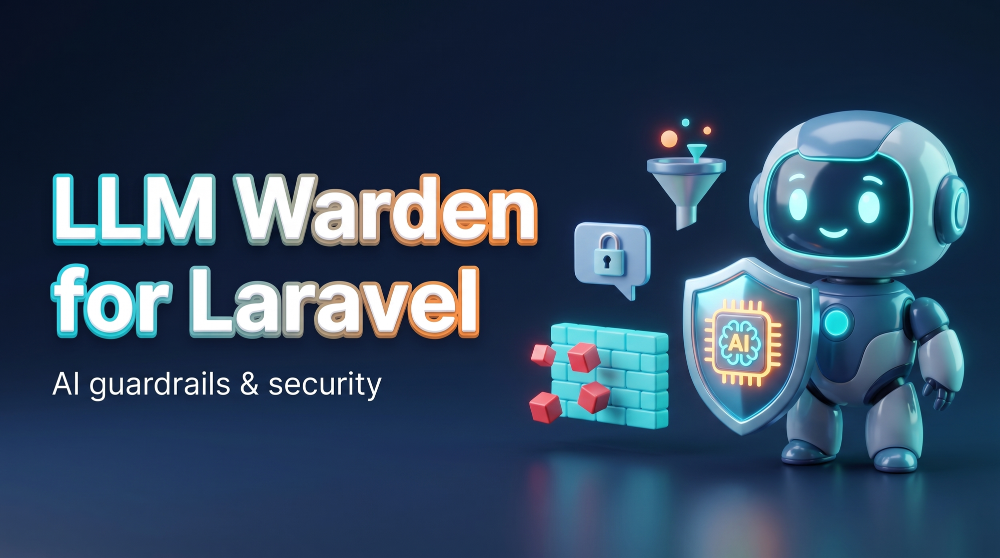

<p align="center">
  
</p>

# Warden for Laravel

[](https://github.com/Sellinnate/laravel-llm-warden/actions)
[](https://laravel-warden.selli.io)
[](https://php.net)
[](https://laravel.com)
[](https://phpstan.org/)
[](LICENSE.md)

**Enterprise prompt sanitization & LLM guardrails for Laravel — deterministic-first, offline-by-default, EU-resident.**

Warden sits between your application and any LLM as a **bidirectional guardrail
layer**. On the way in it normalises and inspects prompts (prompt injection,
jailbreak, PII, secrets); on the way out it validates and filters the model's
response (unsafe content, data leaks, markdown exfiltration, malformed output).

It is **hybrid and modular**: a deterministic core (regex, deny-lists,
heuristics, Unicode normalization) that runs offline at zero cost, plus optional,
swappable AI drivers (moderation APIs, self-hosted classifiers, LLM-as-judge) for
semantic coverage when you want it. Zero mandatory dependencies beyond
`illuminate/contracts`.

> 📚 **Full documentation: [laravel-warden.selli.io](https://laravel-warden.selli.io)**

## Why Warden

- **Deterministic-first.** The rule layer is fast (p95 < 5 ms), free, explainable
  and fully testable. AI drivers are a second stage, never a prerequisite.
- **Normalize before every check.** A single pass (NFKC, confusable folding,
  invisible/bidi stripping, de-leet, spacing collapse, recursive base64/hex
  decode) precedes every detector — so deny-lists can't be trivially bypassed.
- **Find vs. act are separate.** Detectors return typed spans; the action
  (allow / redact / mask / encrypt / block / flag) is a *policy* decision.
- **EU/Italy aware.** Codice Fiscale, P.IVA, IBAN with checksum validation;
  GDPR / EU AI Act friendly; nothing leaves your infrastructure by default.

## Installation

```bash
composer require sellinnate/warden
```

Publish the config (optional):

```bash
php artisan vendor:publish --tag=warden-config
```

## Quick start

```php
use Sellinnate\Warden\Facades\Warden;

// Inspect only — returns a Verdict, mutates nothing
$verdict = Warden::inspect($userPrompt);

if ($verdict->blocked()) {
    abort(422, 'Prompt not allowed.');
}

// Sanitize — returns the Verdict with cleaned text ready for the LLM
$clean = Warden::sanitize($userPrompt)->sanitizedText;

// Inspect the LLM output, restoring pseudonymized values from the Vault
$safe = Warden::inspectOutput($llmResponse, vault: $verdict->vault)->sanitizedText;
```

## What it covers

Anchored to the **OWASP Top 10 for LLM Applications (2025)**:

| OWASP | Concern | Warden |
|-------|---------|--------|
| **LLM01** | Prompt Injection | `InjectionScanner` (+ retrieval guard for indirect injection) |
| **LLM02** | Sensitive Information Disclosure | `PiiScanner` + `SecretScanner` (input & output) |
| **LLM05** | Improper Output Handling | `MarkdownDefangScanner` + `FormatScanner` |
| **LLM07** | System Prompt Leakage | `OutputLeakScanner` (canary + echo) |

PII is **EU/Italy-first** with checksum-validated entities (Codice Fiscale incl.
omocodia, Partita IVA, IBAN, credit cards). The reversible **Vault** lets you send
de-identified text to the model and restore the user's real data in the answer.

## Surfaces

```php
// Facade one-liners
Warden::inspect($text); Warden::sanitize($text); Warden::inspectOutput($text, vault: $v);

// Validation rules
'prompt' => ['required', 'string', new NoPromptInjection],
'bio'    => ['nullable', 'string', new NoPii],

// HTTP middleware (scans nested fields, JSON-aware output)
Route::post('/chat', ChatController::class)->middleware('warden:input,strict');

// RAG / retrieval guard, fluent pipeline, custom policies, events, audit, cache…
```

## Documentation

Full, exhaustive docs at **[laravel-warden.selli.io](https://laravel-warden.selli.io)**:

- [Quick Start](https://laravel-warden.selli.io/getting-started/quick-start) ·
  [Configuration](https://laravel-warden.selli.io/getting-started/configuration)
- [Architecture](https://laravel-warden.selli.io/concepts/architecture) ·
  [Normalization](https://laravel-warden.selli.io/concepts/normalization) ·
  [Policies](https://laravel-warden.selli.io/concepts/policies)
- Scanners: [Injection](https://laravel-warden.selli.io/scanners/injection) ·
  [Secrets](https://laravel-warden.selli.io/scanners/secrets) ·
  [PII](https://laravel-warden.selli.io/scanners/pii) ·
  [NSFW](https://laravel-warden.selli.io/scanners/nsfw) ·
  [Output](https://laravel-warden.selli.io/scanners/output)
- [AI Drivers](https://laravel-warden.selli.io/drivers/overview) ·
  [Vault round-trip](https://laravel-warden.selli.io/usage/vault) ·
  [RAG guard](https://laravel-warden.selli.io/usage/rag)

## Testing

```bash
composer test        # Pest
composer analyse     # PHPStan level 8
composer format      # Pint
```

## Security

If you discover a security vulnerability, please review [SECURITY.md](SECURITY.md)
for the responsible-disclosure process. Do **not** open a public issue.

## Credits

- [Filippo Calabrese](https://github.com/sellinnate) and Sellinnate S.r.l.

## License

The MIT License (MIT). See [LICENSE.md](LICENSE.md).
