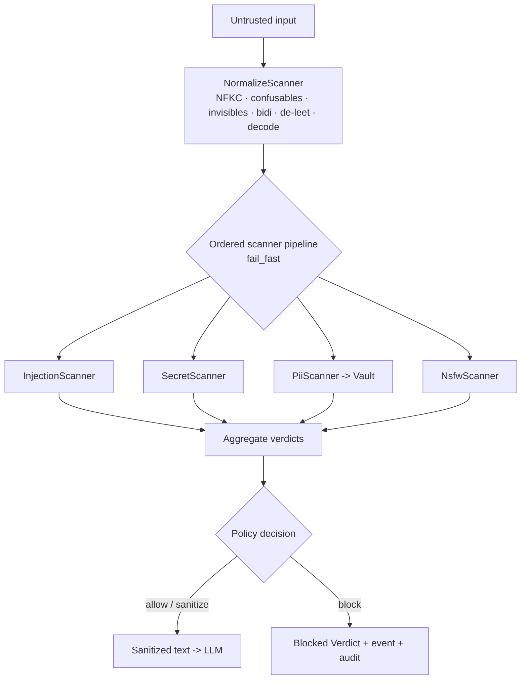

# Architecture

Warden is built from **five concepts**. Keep these clear and the rest of the
design is a consequence.

::: card "1 · Guard"
The orchestrator and public entry point. Exposes `inspect()`, `sanitize()`,
`inspectOutput()`, `inspectRetrieval()`. It resolves the active policy, runs the
ordered scanner pipeline for a direction, and aggregates per-scanner results into
one `Verdict`.
:::

::: card "2 · Scanner"
One stage of the pipeline. Receives the (possibly already transformed) context,
produces a `ScanResult`, and passes the context on. Scanners exist for **input**,
**output** and **retrieval** directions.
:::

::: card "3 · Detector"
The detection logic inside a scanner (e.g. the *Codice Fiscale* detector inside
the `PiiScanner`). Separates *how you detect* (regex / checksum / NER / driver)
from *what you do about it*.
:::

::: card "4 · Driver"
The interchangeable implementation of a component that may be deterministic or AI
(injection: `deterministic` | `llm-judge`; moderation: `null` | `openai` |
`azure`). Managed by a Laravel-style `Manager`.
:::

::: card "5 · Verdict / ScanResult"
Immutable value objects. `ScanResult` is per-scanner; `Verdict` is the final
aggregate returned to the caller.
:::

## The flow



The **output** flow is the mirror image: the LLM response runs through a second
pipeline that de-anonymizes the Vault, detects leaks (canary, PII, secrets),
defangs markdown exfiltration, checks content safety and validates format.

## Design principles

- **Deterministic before probabilistic.** Rules first; AI as an opt-in second stage.
- **Normalize before every check.** One de-obfuscation pass precedes all detectors.
- **Find ≠ act.** Detectors return spans; the action is policy (Presidio model).
- **Explicit, per-scanner fail policy.** Fail-open or fail-closed is configurable.
- **Depend on the minimum.** `illuminate/contracts` only; no mandatory AI deps.
- **Privacy by design.** EU-resident, BYOK, redacted audit, no egress by default.

## Extensibility

Everything pluggable passes through narrow contracts in
`Sellinnate\Warden\Contracts`:

```php
interface Scanner { public function supports(Direction $d): bool; public function scan(ScanContext $c): ScanResult; public function name(): string; }
interface Detector { public function detect(string $normalized, ScanContext $c): array; public function type(): string; }
interface InjectionDriver { public function evaluate(string $normalized, ScanContext $c): InjectionVerdict; public function name(): string; }
interface ModerationDriver { public function moderate(string $text): ModerationVerdict; public function name(): string; }
```

Adding a scanner is a registration on the `ScannerRegistry`; adding a driver is a
`Manager::extend()` — never a fork.
